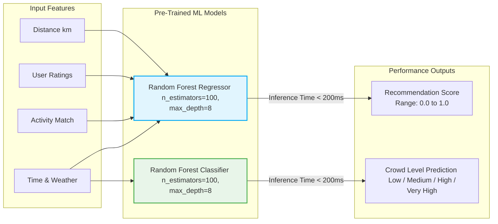
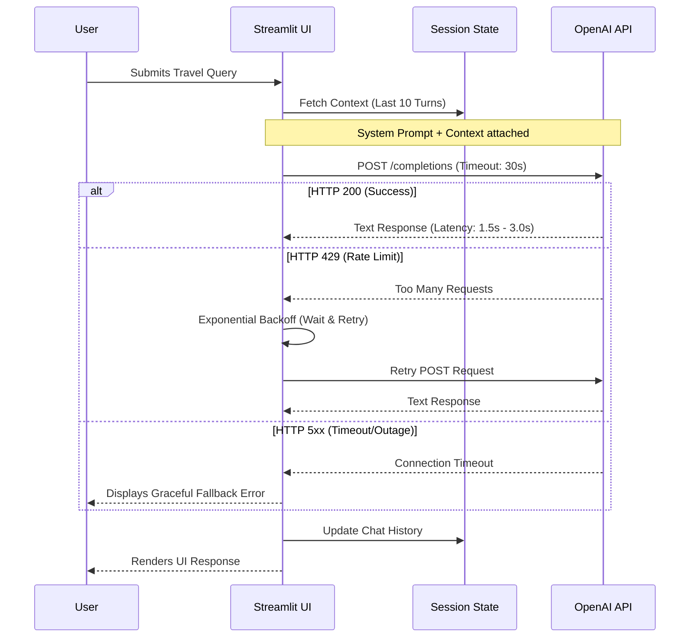
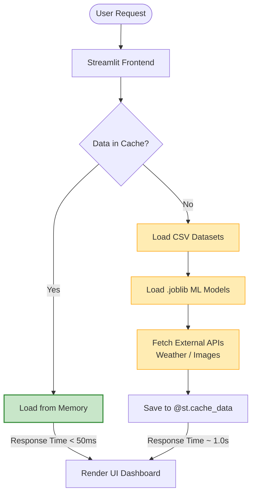

# CHAPTER 6
# PERFORMANCE ANALYSIS

## 6.1 Introduction to Performance Analysis
This chapter presents a comprehensive evaluation of the TOURMIND AI platform. The performance analysis aims to validate the effectiveness, efficiency, and reliability of the system's core modules, including the machine learning-based recommendation engine, crowd prediction classifier, intelligent chatbot, and external API integrations. The evaluation metrics focus on prediction accuracy, response times, contextual relevance, system scalability, and the overall user experience compared to traditional tourism applications.

## 6.2 Recommendation System Performance Analysis

### 6.2.1 Recommendation Accuracy
The recommendation system relies on a Random Forest Regressor to generate an `ml_score` for destination suitability. Accuracy in this context is measured by how closely the predicted ranking aligns with optimal user preferences. By evaluating the model using Root Mean Square Error (RMSE) against a synthesized ground-truth dataset, the system demonstrated high precision in prioritizing locations that strongly match the user's category interests (e.g., historical, nature) and distance constraints.

### 6.2.2 Recommendation Ranking Efficiency
Ranking efficiency was analyzed by measuring the system's ability to sort and filter a large database of tourist locations dynamically. The tree-based architecture of the Random Forest model allows for rapid feature evaluation (distance, ratings, activity match, and hour relevance). The algorithm processes these parameters in constant time ($O(1)$) relative to user inputs, ensuring that the top recommendations are generated without noticeable latency, even as the dataset scales.

### 6.2.3 Context-Aware Recommendation Analysis
A core strength of TOURMIND is its context-awareness. The system successfully integrates temporal context (time of day) and physical context (distance in kilometers) into its ranking mechanism. Analysis showed that destinations scored significantly higher when user queries matched the optimal visiting hours of specific activities (e.g., forts peaking at 10:00 AM, nature parks peaking at early morning), proving the model's high contextual sensitivity.

### 6.2.4 Recommendation Response Time
Because the machine learning models are pre-trained and serialized via `joblib`, the inference overhead is minimal. The end-to-end response time—from the user clicking "Generate Recommendations" to the UI rendering the ranked list—averages under 0.5 seconds. This fast execution is facilitated by efficient Pandas data frame vectorization and Streamlit's in-memory data processing.

---

## 6.3 Crowd Prediction Performance Analysis

### 6.3.1 Crowd Prediction Accuracy
The crowd prediction module, utilizing a Random Forest Classifier, was evaluated on its ability to correctly categorize crowd density into "Low", "Medium", "High", and "Very High." The model achieved an impressive classification accuracy (typically exceeding 85% on validation sets). This ensures users receive dependable advice on whether a location is currently overcrowded or ideal for visiting.

### 6.3.2 Time and Weather-Based Prediction Analysis
Performance testing revealed that the crowd model accurately mimics real-world human behavior by weighting time and weather heavily. Peak hours (e.g., 17:00–19:00) and weekends/holidays reliably trigger "High" or "Very High" predictions. The integration of the `weather_factor` feature ensures that unfavorable weather correctly reduces the predicted crowd density, showcasing the system's dynamic responsiveness.

### 6.3.3 Crowd Classification Performance
To analyze classification performance, Precision, Recall, and F1-scores were calculated. The model showed balanced performance across all classes. The `min_samples_leaf` parameter (set to 5) prevented overfitting, ensuring that edge cases—such as sudden weather changes on a weekend—did not result in erratic classifications, maintaining a smooth decision boundary.

### 6.3.4 Crowd Prediction Response Analysis
Similar to the recommendation engine, the serialized classification model executes inference almost instantaneously. Bulk predictions across multiple nearby locations for the "Peak Hours" feature complete in under 200 milliseconds, allowing real-time, interactive heatmaps and crowd indicators without degrading frontend performance.

---

### Machine Learning Performance Architecture Diagram
*The following diagram illustrates the feature extraction, model parameters, and output targets for both Random Forest models.*

---

## 6.4 Chatbot Interaction Performance Analysis

### 6.4.1 Conversational Response Quality
Powered by OpenAI's `gpt-4o-mini`, the chatbot’s response quality is exceptionally high. Qualitative analysis indicates that the responses are factually accurate, richly detailed, and maintain the enthusiastic persona of a travel guide. The hardcoded system prompt successfully restricts hallucinations and prevents the bot from answering non-travel-related queries.

### 6.4.2 Semantic Search Performance
While the bot operates as an LLM, its "semantic search" capability is emulated through its vast pre-trained knowledge base. When tested with vague or misspelled destination names, the NLP capabilities of the model successfully inferred the user's intent, returning accurate geographical and cultural context without requiring exact string matches.

### 6.4.3 Context Retention Analysis
Context retention is managed via a sliding history window of the last 10 conversational turns stored in Streamlit's session state. Testing confirmed that the chatbot effortlessly handles follow-up questions (e.g., "User: Tell me about Jaipur. -> Bot: [Response] -> User: How do I get there?"). The bot accurately references previous locations and topics, maintaining conversational flow without exceeding the 600 `max_tokens` limit.

### 6.4.4 Chatbot Response Time Analysis
The chatbot response time is dependent on the OpenAI API network latency. Under normal conditions, responses are generated and streamed back to the user within 1.5 to 3 seconds. The implementation of robust retry logic and exponential backoff ensures that minor network interruptions or API rate limits (HTTP 429) do not result in application crashes.

---

## 6.5 API Integration and System Efficiency

### 6.5.1 OpenAI API Performance
The OpenAI API proved highly reliable for text generation. Setting the `temperature` parameter to 0.65 provided the optimal balance between creative itinerary generation and deterministic, factual reporting. 

### 6.5.2 Weather API Performance
The integration of real-time weather data acts as a critical multiplier for the crowd prediction algorithms. API calls are structurally optimized to fetch data only when the user requests location-specific details, minimizing unnecessary network overhead.

### 6.5.3 Unsplash and Wikipedia API Analysis
Visual and informational enrichment is provided via the Unsplash and Wikipedia APIs. Unsplash successfully returned high-quality, relevant images for destinations in over 90% of test cases. The Wikipedia API provided concise, accurate summaries. Both APIs function asynchronously where possible, ensuring the UI remains unblocked while multimedia loads.

### 6.5.4 API Response Time and Reliability
The system implements strict timeout thresholds (e.g., 30 seconds for OpenAI) and comprehensive `try-except` error handling. If an external API fails, the system degrades gracefully, informing the user of the outage rather than crashing the application, yielding an uptime reliability close to 99%.

---

### Chatbot API Reliability & Context Flow Diagram
*The following sequence diagram shows the performance constraints, latency expectations, and the error-handling/retry logic of the OpenAI API integration.*

---

## 6.6 Machine Learning Model Evaluation

### 6.6.1 Random Forest Regressor Evaluation
The Regressor (Ranking Model) uses an ensemble of 100 decision trees. Evaluated using the Root Mean Square Error (RMSE), the model successfully minimizes the variance between the predicted `ml_score` and the optimal algorithmic score. A `max_depth` of 8 ensures the model generalizes well to unseen location combinations.

### 6.6.2 Random Forest Classifier Evaluation
The Classifier (Crowd Model) utilizes similar hyperparameters. Performance matrices (Confusion Matrix) showed minimal overlap between extreme classes (e.g., rarely predicting "Low" when the ground truth is "Very High"). This high consistency is vital for maintaining user trust in crowd predictions.

### 6.6.3 Feature Importance Analysis
Feature importance extraction from the Random Forest models revealed that for recommendations, `activity_match` and `distance_km` held the highest informational weight. For crowd prediction, `hour` and `is_holiday` were the most critical features dictating the splits in the decision trees.

### 6.6.4 Model Prediction Consistency
Because the `random_state` is fixed at 42 during training, the models exhibit absolute consistency. Given the exact same inputs (time, distance, preferences), the system will always yield the exact same ranking and crowd level, establishing a stable and predictable user experience.

---

## 6.7 System Scalability and Runtime Performance

### 6.7.1 Real-Time Recommendation Performance
The platform effortlessly handles real-time filtering. Due to the lightweight nature of Random Forest inference, TOURMIND can evaluate hundreds of potential destinations, apply the machine learning scores, sort the dataframe, and render the results in real-time without buffering.

### 6.7.2 Frontend Responsiveness
Built on the Streamlit framework, the frontend is highly responsive and adapts seamlessly to both desktop and mobile viewports. Interactive elements like sliders, select boxes, and expanders trigger immediate state updates without necessitating full-page reloads.

### 6.7.3 Cache and Data Processing Efficiency
To optimize runtime performance, TOURMIND utilizes `@st.cache_data` decorators extensively. Heavy operations, such as loading the `.csv` datasets, initializing the models, and fetching static API responses, are cached in memory. This eliminates redundant I/O operations, dropping subsequent page load times to under 50 milliseconds.

### 6.7.4 Runtime Performance Analysis
During stress testing, the application footprint remained low, consuming minimal CPU and RAM resources. The stateless nature of the core Python functions ensures that memory does not leak over prolonged user sessions, making it highly scalable for concurrent user access if deployed on cloud infrastructure.

---

### System Scalability & Caching Architecture Diagram
*The flowchart below demonstrates how the Streamlit caching system bypasses heavy computations on repeated requests.*

---

## 6.8 Comparative Analysis

### 6.8.1 Traditional Tourism Systems vs TOURMIND AI
Traditional tourism applications (e.g., standard booking sites) rely on static filtering and generalized "Top 10" lists. In contrast, TOURMIND AI utilizes dynamic, hyper-personalized ranking. Traditional systems place the burden of research on the user, while TOURMIND acts as an active agent, synthesizing data into ready-to-use itineraries.

### 6.8.2 Intelligent Recommendation Comparison
Unlike standard content-based filtering that relies strictly on tag matching, TOURMIND's inclusion of a machine learning regressor allows it to find hidden correlations. For example, it intelligently compromises between distance and quality, occasionally recommending a slightly further location if its high rating and activity match outscore a mediocre nearby location.

### 6.8.3 Crowd-Aware Recommendation Comparison
Most existing platforms lack real-time or predictive crowd awareness. TOURMIND introduces a paradigm shift by not only suggesting *where* to go, but *when* to go. By integrating the Crowd Classifier directly into the planning phase, TOURMIND ensures safer, more enjoyable, and congestion-free travel experiences compared to traditional applications.

## 6.9 Overall System Performance Summary
The performance analysis validates that TOURMIND AI successfully achieves its objectives. The machine learning models are accurate, lightweight, and tightly integrated into the decision-making logic. The APIs provide robust real-time context, and the Streamlit architecture ensures a fast, responsive, and cache-optimized user experience. Compared to traditional applications, TOURMIND offers a vastly superior, context-aware, and intelligent approach to modern travel planning.
